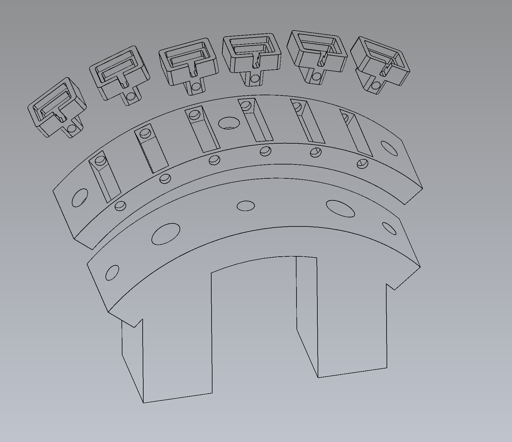
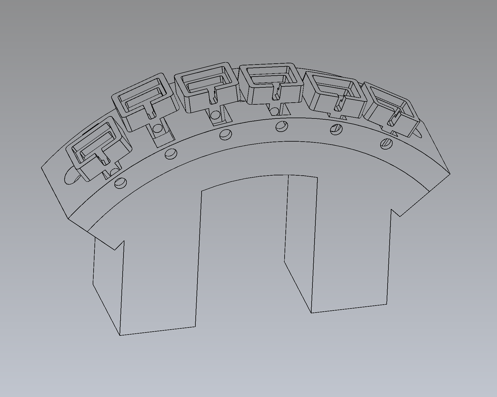

# violet-bridge
CadQuery based python scripts to generate STEP and SVG renderings of components of a viola da gamba bridge.
The bridge saddles can be moved fore and aft to allow fine intonation adjustments
The saddles have recesses such that RMC pizz/arco pickups can be installed.





## Requirements

`bridge.py`, `bridge_body.py`, `assembly.py`:

```bash
python3 -m venv .venv && .venv/bin/pip install -r requirements.txt
.venv/bin/python assembly.py
```

Python 3.10–3.12. Use `.venv/bin/python` rather than a bare `python`.

## Pickup electronics

The phase-switching preamp for the RMC pizz/arco pickups that sit in the
saddles has its own repository:
<https://github.com/pythagorean-comma/rmc-pizz-arco>. It was extracted from
this one on 2026-08-01 — it shares no dependencies with the bridge geometry
and needs KiCad rather than CadQuery.

The board's history up to that point is in this repository, at the
`electronics/` path. That includes the original 88 × 112 mm hand-buildable
version, which the new repository does not carry:

```bash
git checkout a670b3e -- electronics/
```
